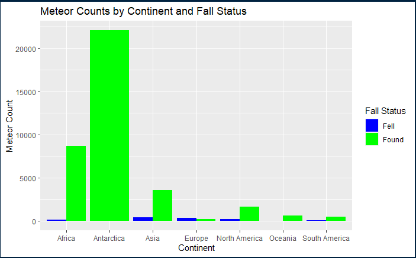
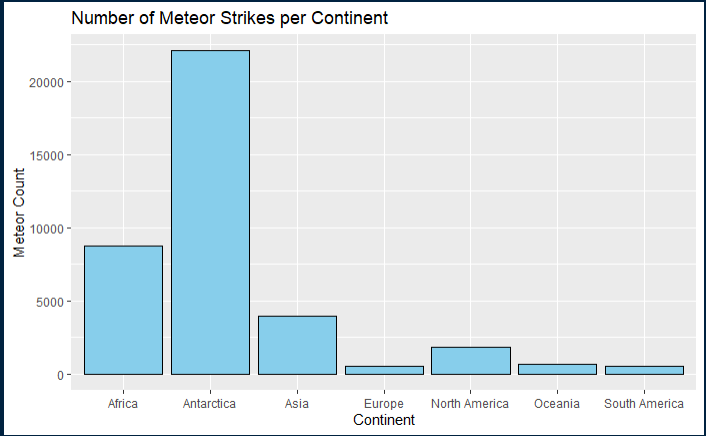
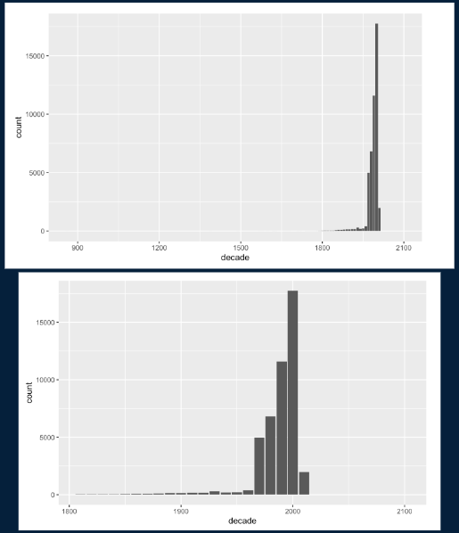
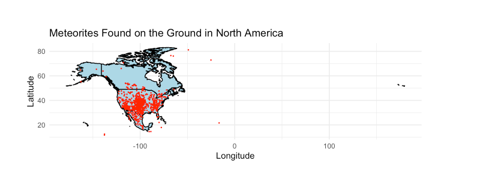
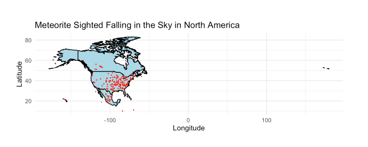

### Introduction
This topic is useful for scientists to determine where they should be investigating meteors. Scientists only have
a finite amount of funding. This data will help them determine where they should invest their resources to find
their meteorite samples. This will help scientists find their meteorite samples and ensure that they are able to
make their research more efficient. This would be interesting for the scientist to use. We already know that
meteors must be found on a continent. We know that meteors can be composed of many different materials. We also
know that there are various sightings from around the world that we should account for. What we want to do is to
help scientists find the heaviest meteor sample and the years of most impact. This is important for scientists to
know because they might be able to notice yearly trends. If they can notice these trends, they can determine
potential years where there could be more meteor sightings. Another question we will answer is how many meteors
have been spotted on each continent. This will help scientists determine where to search for meteors. Scientists
need to know where to search for specific types of meteors. This will help scientists better spend their funding
so that they can gather the most evidence possible. These scientists need high level information to determine
whether a continent is suitable for further investigation and experimentation. Scientists will need to factor in
the costs for setting up observation posts and the costs of conducting their experiments. This is why we will
have a meteor per KM variable to help scientists find where they can find the most meteors. The final question
we will answer is what regions all the meteors have been spotted in. We will graph this on a map to create a
visualization for scientists to use to find areas where meteor observations are high. This is interesting because
this data will help scientists understand where to find meteors. They will be able to find meteors and their
meteor samples more effectively. If they can find these meteor samples more efficiently then they can gather
more data. This will help scientists draw better conclusions as they will have access to the different meteor
types and the locations of the meteors. They will also have the data to determine meteor trends throughout the
world. They can use this data to help them determine where to find meteor samples. Also, the map we generate
will help scientists find regions for them to focus their observations.

### Explain Data
For all 3 questions question we used the meteorite dataset because when looking at the trending datasets on
Kaggle, it had an adequate number of rows and columns and appeared to be credible since it is backed by NASA.
Additionally, we wanted to choose a fun topic that would be interesting and differ from the datasets we have
practiced with before. The meteorite dataset originates from The Meteoritical Society, which is an international
organization focused on research and education in planetary science, specifically meteorites. The data was
provided by The Meteoritical Society and contains information on all of the known meteorite landings. The Fusion
Table was collected by Javier de la Torre, but the data was likely compiled from a network of scientists,
professionals, and enthusiasts across the world. This dataset is intended for public access and use. It is
available on data.gov and NASA’s public database. The dataset provides information regarding each known meteorite
sighting across the world. It contains information about the name and ID of each meteorite sighting, its
classification (valid/relict and fell/found), the mass of the meteorite, the year it was observed falling/found,
and the geolocation of it. The dataset contains roughly 34,500 entries and is being updated regularly as new
meteorite sightings occur. The data provided seems to be fairly complete and accurate, our only concern is how
the scientists determine what is a meteorite. As Professor Toomet mentioned to us, the dataset does not clarify
how it identifies these meteorites and people could be falsifying meteorite status. However, since the dataset is
endorsed by NASA and does not claim to record every meteorite ever impacted with Earth, we are comfortable
proceeding with data analysis. Each row represents a meteorite. This dataset has 45,716 observations. The
relevant variables are ‘name’ which represents the name of the meteorite and is coded as a string, ‘mass (g)’ of
the meteorite which is coded numerically, ‘fall’ which represents whether the meteorite was observed falling or
found later and is coded as a string, ‘year’ of the meteorite observed falling or found which is coded
numerically, and ‘reclat’ and ‘relong’ which represent the coordinate latitude and longitude of the meteorite’s
landing site and are both coded numerically. There are 131 missing values for ‘mass (g)’, 291 for ‘year’, 7315
for ‘reclat’, and 7315 for ‘reclong’. This means that there is a significant amount of data missing for
geographic location, which limits the analysis we can do in this regard, but everything else seems great.
For the second question about where it's most likely to see a meteor the data set came from two websites and these
websites are https://www.kaggle.com/datasets/anoopjohny/meteorite-landings. We used this data set for this
question as it provided us with information about meteor observations throughout the world and the continents and
their sizes respectively. The size csv file was given to me for free use. This csv file has the continent size
which is important for us to know how many meteors are observed per kilometer. The combination of data from these
data sets will help scientists find the most meteors. The data permission for both data sets is free use. The
world population website is intended for free use. My friend gathered this csv file himself by creating a
specific csv file for himself. This Kaggle data was collected by NASA and their collaborators. It was verified
by NASA. These data sets are intended for scientists. Some data quality issues we found were that the meteor
didn't always fall within a continent. This is because they were seen over an ocean. This means that the meteor
wasn't seen over land. We had to account for these meteors, and we made an unknown column for that. Also,
Antarctica has no permanent population so the population tab for this row will be left as NA. But it's important
to include Antarctica since it is a valid land mass where scientists can set up observation posts for a specific
season. This final data frame contains 16,297 rows and 8 columns. Each row represents a single meteor observation
in the world. Year represents the year the meteor was spotted or found. Name is for the name of the meteor. fall
determines if a meteor was seen in the sky or found in the ground. Lat represents the latitude of the meteor.
Long represents the longitude of the meteor. Continent represents the continent the meteor was found or seen from.
Meteor count represents the count meteor count for each continent. Population represents the number of people on
the continent. Missing data is classified as meteors with a latitude or longitude value. There were 7315 entries
of these, and we filtered these out before calculating our meteor per continent data. 
For our final question, found_metorites represents all meteors found in North America on the ground. fell_meteorites
represent all falling meteors in North America. The two data frames share the same amount of variables. They had
a name which represents the name of the meteor. ID represents a numeric ID of the meteor. nameType represents if
the meteor finding is genuine. recclass provides information about the meteor’s composition. Mass (g) gives the
mass of the meteor in grams. fall/found changes between those two data frames. Fall represents a meteor that was
falling in the sky. Found means a meteor was found on Earth. reclat gives the latitude of the sighting. reclong
gives the longitude of the sighting. For the found_meteorites there were 1646 rows which means there were 1646
entries. For fell_meteorites there were 184 sightings in North America. There were 9 columns for each variable.
The found_meteorites data set has 13 invalid entries. The data missing variables for all entries are mass (g) and
year. The fell_meteorites data set has only 1 invalid entry. This entry is missing the mass(g). This case is
especially odd since it's the only falling meteor without this data. There could be various reasons as to why
the meteor could've been tampered with or lost.

### Discuss methods
For the first question, we only included ‘name’, ‘mass’, and ‘year’, because we were trying to figure out the
heaviest meteorite in the year of most impacts, which only requires these three variables. We did end up creating
two new variables, decade, and impacts, using these variables, which is described in the following section. For
the first question, we wanted to get a feel for the data, specifically plot the number of impacts over time to
grasp the graphical shape of observations. After removing NA values for year and mass (explained below), we created
a bar plot of decade versus number of impacts by creating a decade variable because the thousands of years of
data looks too cluttered and hard to read without. We noticed that the highest points on this bar plot were
grouped after the year 1800 to now, so we created another bar plot of decade versus number of impacts by filtering
the dataset to only years above 1800 to get a clearer look. This graph made it apparent that the decade 2000 had
the most recorded impacts, which gave us a greater understanding of the data but also a verification to the
following computational analysis. Next, we took the cleaned meteorites dataset (without the NA values described
above) and grouped by year, created a new variable ‘impacts’ that sums the number of meteorites in each group
(year). By arranging this grouped data frame in descending order by impacts, it became clear that the year 2003
contained the most observed impacts with a total of 3323. After determining the year of most impacts, we filtered
the cleaned meteorites dataset to only include the year 2003 and then arranged in descending order again, this
time by mass, to find the heaviest meteorite in the year of most impacts: Qijiaojing. Since the first question
focused on mass and year, we decided to remove all missing values for these variables.

For the question about meteors per continent, we decided to include those 8 variables because these variables
would be useful for a scientist to use. They would likely need to know the year to track the frequency of meteor
observations. They need the name to identify each meteor. They will need the fall variable to determine if it
was found on earth or not. Then the latitude and longitude variables are helpful for them to pinpoint where the
meteor was observed. The continent will represent where on the Earth it was observed. Meteor_count represents
the number of meteors observed on a continent. Finally, we have size where it represents the size of each
continent. This will help scientists better understand where meteors are more common. We selected these data sets
as we felt like these were the most relevant and accurate data sets for this question. To process the data, we had
to add a new column for the continent that a meteor was found on. This was done by checking the bounds of the
meteor’s latitude and longitude observation. Then we assigned each meteor a continent. Then we also added several
meteor count variables for each continent so that a scientist will know how many meteors landed on one continent.
Something we had to consider here was how to account for meteors observed outside on the ocean. We decided to
have an unknown variable which represents meteors not on any continent. It can be assumed these meteors landed
either in the ocean or a different part of the world without a continent. We also had to filter out meteors with
missing latitude and longitude values as these would be invalid meteors for this question. A scientist would need
to know where a meteor impacted or was observed for this data set to be effective. We also had to add Antarctica
to the population data set to ensure an accurate merging of data sets.
 
To answer the question, how many meteorite sightings have been sighted in North America? 
Where did each sighting occur (map each sighting), I needed to first filter our dataset 
to include data from only North America. Because our dataset is only organized by 
geoLocation (coordinates), rather than by region, we had to take some liberties with 
our classifications. We used a rough estimate of longitude and latitude coordinates 
that encompass North America and set that as our boundaries. This allowed me to filter 
our results according to meteor sightings that occurred only within this box. We then 
were able to count all the results (total rows) that fit these restrictions. In terms 
of answering the second part of the question, I was able to use the map package to 
plot our data onto a world map. We stored all our filtered information (meteor 
sightings within Northern America) into a new variable and input that into our plot. 
We provided a plot of the world map and of a zoomed in version of just North America. 
We used the variables fell/found to filter if the meteor were found in the sky or on 
the ground, and reclat and reclong to filter the results to only North America. We 
processed our data by first filtering the data to only display results for fell 
meteorites, and then We filtered it to only have geoLocations that corresponded to 
our rough estimate of North America. We chose our sample to be North America because 
that felt the most pertinent to us, living in the United States. Choosing this as our 
sample, we were able to provide data for how many known meteor sightings have occurred 
in a relatively small radius to where we live, and provide a visual representation as 
to where these sightings have occurred within North America.

### Result

The result for this question shows that most meteor sightings were found on planet Earth. 
This tells us that most meteors will be found on the ground and that is where scientists 
should focus their efforts. This will yield them the most meteorite material and 
observations. We also have learned that Antarctica is the place to search for meteors. 
If scientists need to find more meteorite samples, then they should investigate Antarctica 
further. This could be because the Antarctic preserves its landscape due to the cold. It 
freezes anything in place, so meteors aren't lost to erosion. There are also very few 
humans resulting in less tampering with the meteors. We also learn if scientists want 
to observe meteors falling in the sky. They should focus their efforts on Asia as that 
is the place with the most falling observations. This could be due to the vast forest 
of Asia resulting in more potential sightings.

The bar plots reveal a gradual rise in the number of meteorite impacts observed 
from 1800 to now. This number rose severely in the second half of the 20th century, 
which could be due to an increase in scientific technology and knowledge. The high 
point of this graph occurs in the decade of the 2000s, with over 17,000 observed 
impacts in this ten-year period. The 2010s, however, have a significant decline in 
the number of findings and is the last decade present. These graphs tell us that 
while the number of observations were increasing for a while, there has been a 
sudden change in trend after the 2000 - 2010 decade. Further analysis and computation 
reveal that 2003 is the specific year of the most meteorite impacts and Qijiaojing is 
the heaviest of that year.

Based on the results of the data and from the plottings on the map, most of the 
meteor sightings that occurred in North America occurred in the United States. 
Specifically, we can see that most sightings happened right in the center of the 
US, on the borders between the Midwest and Southwest. There are little sightings 
that occurred in Canada or Alaska, and few that occurred on either coast.

### Discuss
Our overarching storyline involves how at risk we are in Seattle of experiencing a
meteorite impact. Whether that is a timeline of number of impacts, breakdown of
continents, or mapping of impacts in North America, these pieces all come
together to inform us of meteorite observation trends. The first question led to
bar plots visualizing the number of observed impacts over time, which had the
possibility to inform us if these impacts/discoveries were happening more
frequently over time and would raise concern. However, we found that although
there was a dramatic increase in meteorite impacts in recent decades, there was
a dramatic drop in the 2010s that reduces some fear of likelihood being impacted
in Seattle. It is important to note that this dataset does not claim to include
every meteorite observation since the first year documented, and there are
surely many undiscovered meteorites that have not been found yet - think about
oceans, buried meteorites, and remote, unexplored areas. Additionally, this
dataset includes both found and observed falling meteorites, which means that
just because a meteorite is labeled with a certain year, does not mean that the
impact was in that year. I think that a dataset with information regarding only
when the meteorite impacted Earth would be able to better predict trends in how
at risk we are of impact in the coming years. Even if the meteorite was found
hundreds of years after impact, technology might be able to determine the age
based on elemental composition and infer when it landed, which would be useful
in producing a more accurate bar plot of impacts over time.

For the second question, it answers the question of where to look for meteors. This
will help scientists determine where to look for fallen or falling meteors. This
data set can greatly help scientists determine where to focus their efforts when
searching for meteors. This answered the where to search for meteors. Scientists
should investigate either Africa or Antarctica for meteor samples. But one
limitation of this data is the lack of specific geographic data. We do have the
latitude and longitude of each meteor, but it is not sorted by which country
they landed in. This will hinder scientists from knowing where to exactly start.
This contributes to our overarching storyline. Our data gives scientists an idea
of the general area to investigate meteors. Further work that could be done for
this data set is to map each meteor to a specific country of sub region of the
world. This will greatly help scientists determine the specific locations to
establish research stations for meteor sightings. This will likely require more
advanced code as we need to be able to map a specific x and y point to a
real-life x and y point and map it to the closest country. Furthermore,
scientists can also use this data to determine the validity of meteor samples.
Samples in Antarctica or less populated areas will be more likely to be valid
meteor samples. This will help scientists determine where they should look to
gather their meteor sightings,

Based on our results we can understand the geographical distribution of meteorite
sightings within North America. This information aids scientists in studying
patterns and concentrations of meteorite falls in different regions, which could
be linked to geological features, impact craters, or other factors. By
identifying areas with frequent meteorite sightings in North America (i.e. border
between the Midwest and Southwest), we can assess potential risks associated
with meteorite impacts. It helps in recognizing regions that might be more prone
to future impacts, facilitating risk management and disaster preparedness
efforts. Additionally, mapping meteorite sightings aids in locating potential
sites for scientific research and exploration. Researchers can target specific
locations for field studies, collection of samples, and further analysis to
better understand meteorite compositions, origins, and their implications for
planetary science. Our storyline focuses on how at-risk Seattle residents are
for experiencing a meteorite impact. My results provide a trend of past meteorite
sightings in the United States. This is helpful as it shows the distribution of
sightings and shows that the Pacific Northwest does not have a history of high
impact. Based on the map, the Pacific Northwest and Washington have a low number
of sightings. This means that based on previous data, Seattle residents should
have a low probability of experiencing a meteorite impact, especially as opposed
to the Midwest and Southwest. Because our dataset can never be fully
comprehensive as there are meteors out there that have never been found, our
data can only be so accurate. We are limited to the data we have which is
non-exhaustive. Our overarching storyline and big question that we aimed to
answer was how at risk are Seattle residents from experiencing a Meteorite
impact. And while we were able to provide answers based on previous sightings,
a large part of our data is meteorites that were found on the ground. This means
that these fallen meteorites could have been found years after the impact date
(and

### Summary
The general summary of this data is that meteor is that meteor observations have
only increased in recent years. This is due to the increased observational
abilities of scientists. Scientists have new tools to create and observe
meteors. Meteor observations are now more accurate and common compared to meteor
observations from the past. Scientists can see more meteors and have more
efficient tools to find meteors. We’ve also concluded that meteors are most
observable from Africa and Antarctica. This is most likely due to their size
and infrastructure. Since Antarctica has no permanent population then there’s
less light pollution. This allows for more observations of the sky. The
nighttime sky is clearer compared to other continents. Furthermore, due to its
isolation no one has interacted with the fallen meteor samples. If we find a
meteor sample in Antarctica, then we know it’s going to be a valid meteor sample.
Africa is less developed resulting in less light pollution as well. Their sky
observation of meteors is more common since there is very little light
pollution. Scientists have a clearer view of the sky. We’ve also concluded
that meteors have fallen on Antarctica and Africa the most. This data set also
helps scientists better understand the geographic distribution of meteor
sightings in North America. Since many scientists will be from this region this
data would be of more use to them. They can use this data to better prepare for
the effects of meteor impacts. Our map shows scientists where meteor impacts
occur, and this can help them prepare resources to aid those strikes. This data
also helps to show scientists where to search for meteors when operating in
densely populated regions. This is important since many scientists will need to
work in these regions. Generally, our data set provides scientists with the
knowledge of how to find the heaviest meteor samples. It also provides them
with an answer for when to observe meteors. It provides them with the global
ratio of meteors, so they know where to best look. Finally, it provides them
with data on where to look for meteors in densely populated areas. It can also
show scientists how likely a meteor is to land in a populated area.
